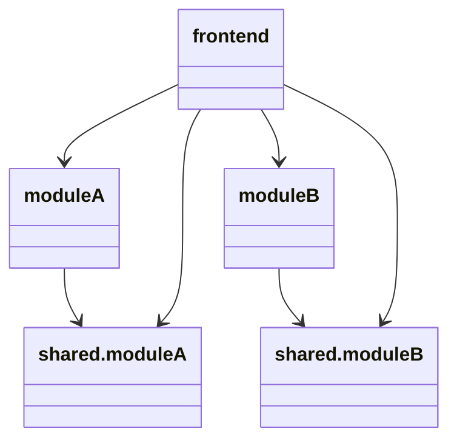

# MyModularMonolithSample

```mermaid
classDiagram
    class frontend
    class moduleA
    class `shared.moduleA`
    class moduleB
    class `shared.moduleB`
    moduleA -->  `shared.moduleA`
    frontend -->  `shared.moduleA`
    frontend --> moduleA
    moduleB -->  `shared.moduleB`
    frontend -->  `shared.moduleB`
    frontend --> moduleB
```